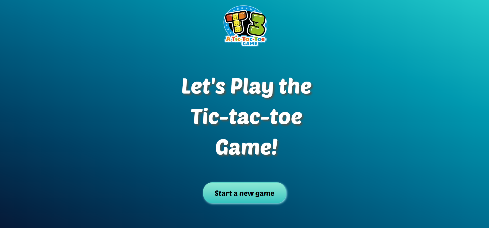
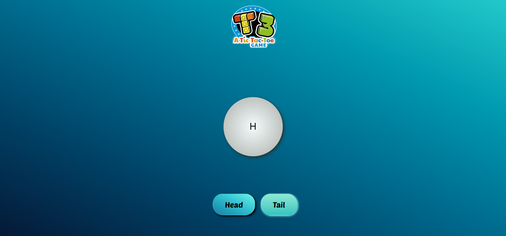
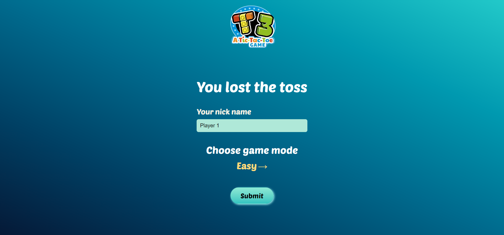
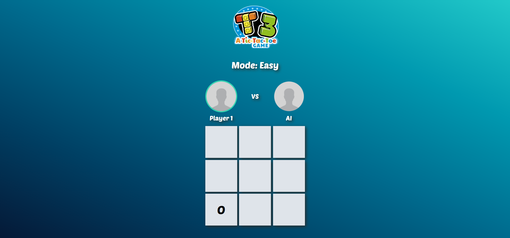
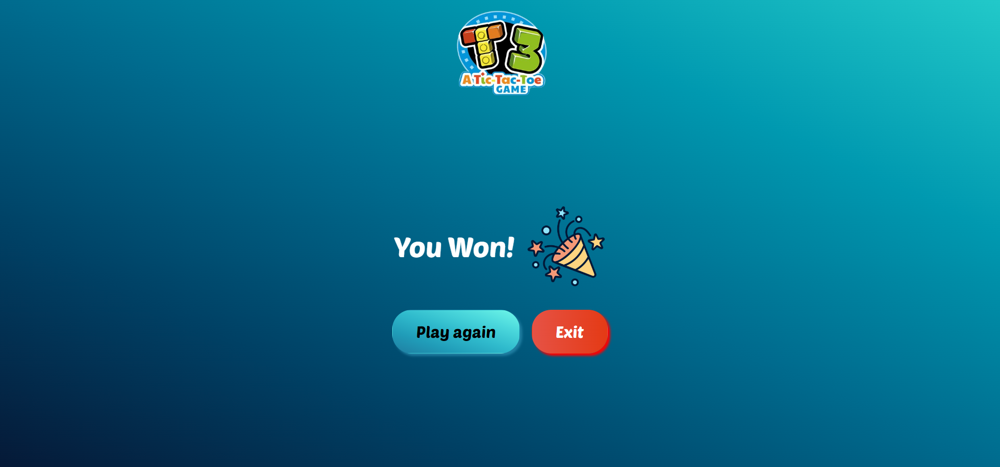

# 🎮 Tic-Tac-Toe


## Description

This is an interactive, responsive Tic Tac Toe game built using HTML, CSS, and JavaScript. The game includes multiple difficulty levels and exciting sound effects to enhance the gaming experience. You can also customize the game with player nicknames and enjoy a coin toss to decide who gets to play with 'O' or 'X'.

## 🌟 Features

- <b>Coin Toss</b>: The toss decides who plays as 'O' and who plays as 'X'.
- <b>Nickname Input</b>: You can add your own nicknames for a more personalized experience.
- <b>Three Difficulty Modes</b>:

  - 🟢 <b>Easy</b>: The system randomly selects empty spots.
  - 🟡 <b>Medium</b>: The system plays strategically for two turns, then randomly.
  - 🔴 <b>Hard</b>: The system selects moves wisely, making it difficult to win!

- <b>Sound Effects</b>:
  - 🎵 <b>Winning/Losing/Draw Sounds</b>: Unique sound effects for different outcomes.
- 🖊️ <b>Pencil Sketch Sounds</b>: When drawing O or X, enjoy the sound of pencil sketches.
- 🎲 <b>Toss Sound</b>: A sound for the coin toss.
- 🔘 <b>Button Clicks</b>: Button click feedback sounds.

## Screenshots







## Technologies Used

- <b>HTML5</b>: For structuring the game.
- <b>CSS3</b>: For responsive and visually appealing design.
- <b>JavaScript (ES6)</b>: For game logic, difficulty modes, and sound effects.

## Demo Link

A live demo can be found [here](https://abdur-rahman-apu.github.io/Tic-Tac-Toe-JS/)

## Installation

1.  Clone the repository:

```bash
git clone https://github.com/Abdur-Rahman-Apu/Tic-Tac-Toe-JS.git
```

2.  Open index.html in your browser to play the game.

## How to Play

1. Use the coin toss to determine who will play as 'O' and 'X'.
2. Enter your nickname.
3. Select a difficulty mode (Easy, Medium, or Hard).
4. Take turns clicking on the grid to place your symbol.
5. The first player to get three symbols in a row, column, or diagonal wins!
6. Enjoy the sound effects for each moment in the game.

## Credits

This project was created as part of the [JavaScript Ninja Bootcamp](https://webdeveloperbd.net/js-bootcamp/).

## License

This project is licensed under the MIT License - see the [LICENSE](./LICENSE.md) file for details.
